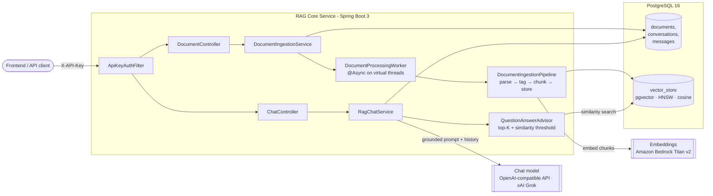

# RAG Core Service

[](https://github.com/jumba2010/rag-core-service/actions/workflows/ci.yml)


A production-oriented **Retrieval-Augmented Generation (RAG)** backend built with **Java 21, Spring Boot 3 and Spring AI**.
It turns an organization's internal documents (PDF, Word, PowerPoint, HTML, Markdown, CSV...) into a searchable
knowledge base and exposes a grounded, citation-aware chat API on top of it.

The service is intentionally provider-agnostic: chat completions go through an **OpenAI-compatible endpoint**
(configured for xAI Grok), embeddings are produced by **Amazon Bedrock Titan**, and vectors live in
**PostgreSQL + pgvector** - each one swappable through configuration alone.

---

## Highlights

| Area | What it does |
|------|--------------|
| **Asynchronous ingestion** | Uploads return `202 Accepted` immediately; parsing, chunking and embedding run on **virtual threads** (`@Async` + `spring.threads.virtual.enabled`). Document status moves `PENDING → PROCESSING → READY / FAILED`. |
| **Extensible pipeline** | Ingestion is a **Template Method** (`parse → tag → chunk → store`) with pluggable `DocumentReaderFactory` and `ChunkingStrategy` (Strategy pattern). New variants (OCR, PII redaction) plug in without touching orchestration. |
| **Token-aware chunking** | `TokenTextSplitter` windows chunks by token count so every chunk fits the embedding model's context, regardless of text density. |
| **Grounded answers with sources** | A `QuestionAnswerAdvisor` retrieves the top-K chunks above a similarity threshold; responses return de-duplicated **source references** (document, snippet, score). |
| **Conversation memory** | Conversations and messages are persisted, and prior turns are replayed to the model for multi-turn chat. |
| **Robust failure handling** | Ingestion failures (including `LinkageError`s from parser libraries) are captured and surfaced as `FAILED` with a reason, never leaving documents stuck. |
| **Consistent errors** | All errors are **RFC 7807 `ProblemDetail`** responses via a central `@RestControllerAdvice`. |
| **Security** | `X-API-Key` authentication using a **constant-time comparison** that **fails closed** when no key is configured. CORS allow-list is externalized. |
| **Operability** | Flyway migrations, Actuator liveness/readiness probes, graceful shutdown, OpenAPI/Swagger UI, container-aware JVM settings, non-root Docker image. |
| **Real integration tests** | Testcontainers boots a real `pgvector/pgvector:pg16` instance so migrations and vector schema are verified exactly as in production. |

---

## Architecture



### Request flow - asking a question

1. `POST /api/v1/chat` resolves (or creates) the conversation and loads prior messages.
2. The `QuestionAnswerAdvisor` embeds the question and runs an HNSW cosine search in pgvector.
3. Retrieved chunks are injected into a strict system prompt that forbids answering outside the context.
4. The answer and its source references are persisted and returned to the caller.

---

## Tech stack

- **Language / runtime:** Java 21 (records, pattern matching, text blocks, virtual threads)
- **Framework:** Spring Boot 3.5, Spring Web MVC, Spring Data JPA, Bean Validation
- **AI:** Spring AI 1.1 - OpenAI-compatible chat client, Bedrock Titan embeddings, PDF & Tika document readers
- **Persistence:** PostgreSQL 16, pgvector (HNSW index), Flyway
- **API docs:** springdoc-openapi (Swagger UI)
- **Testing:** JUnit 5, Mockito, AssertJ, Testcontainers
- **Delivery:** Multi-stage Dockerfile (BuildKit cache mounts, non-root user), Docker Compose, GitHub Actions CI

---

## API

All endpoints under `/api/**` require the header `X-API-Key: <your key>`.
Interactive docs are available at **`/swagger-ui.html`** once the service is running.

### Documents

| Method | Endpoint | Description |
|--------|----------|-------------|
| `POST` | `/api/v1/documents` | Upload a file (`multipart/form-data`, field `file`, max 25 MB). Returns `202` with status `PENDING`. |
| `GET` | `/api/v1/documents` | List all ingested documents and their status. |
| `GET` | `/api/v1/documents/{id}` | Get a single document (status, chunk count, failure reason). |
| `DELETE` | `/api/v1/documents/{id}` | Delete a document **and** all of its vectors. |

```bash
curl -X POST http://localhost:8080/api/v1/documents \
  -H "X-API-Key: $API_KEY" \
  -F "file=@employee-handbook.pdf"
```

### Chat

| Method | Endpoint | Description |
|--------|----------|-------------|
| `POST` | `/api/v1/chat` | Ask a question. Omit `conversationId` to start a new conversation. |
| `GET` | `/api/v1/chat/{conversationId}/messages` | Full conversation history. |

```bash
curl -X POST http://localhost:8080/api/v1/chat \
  -H "X-API-Key: $API_KEY" -H "Content-Type: application/json" \
  -d '{"message": "How many vacation days do new employees get?"}'
```

```json
{
  "conversationId": "5b1d7f0e-8c3a-4f5e-9a51-2f0d3c9b7a11",
  "answer": "New employees receive 22 working days of paid vacation per year (employee-handbook.pdf).",
  "sources": [
    {
      "documentId": "a3c9...",
      "filename": "employee-handbook.pdf",
      "snippet": "All full-time employees are entitled to 22 working days...",
      "score": 0.83
    }
  ]
}
```

Errors follow RFC 7807:

```json
{ "type": "about:blank", "title": "Not Found", "status": 404, "detail": "Document a3c9... not found" }
```

---

## Running locally

### Prerequisites
- JDK 21, Docker
- An xAI (or any OpenAI-compatible) API key
- AWS credentials with access to Bedrock Titan Text Embeddings v2

### 1. Start PostgreSQL + pgvector

```bash
docker compose up -d
```

### 2. Configure and run

```bash
export API_KEY=change-me                # key clients must send in X-API-Key
export XAI_API_KEY=xai-...              # chat model
export AWS_REGION=us-east-1             # + standard AWS credentials for Bedrock
./mvnw spring-boot:run
```

### 3. Or run everything in a container

```bash
docker build -t rag-core-service .
docker run -p 8080:8080 --env-file .env rag-core-service
```

### Configuration reference

| Variable | Default | Purpose |
|----------|---------|---------|
| `API_KEY` | *(empty → all requests rejected)* | Shared secret for `X-API-Key` |
| `DB_HOST` / `DB_PORT` / `DB_NAME` | `localhost` / `5432` / `rag_core` | PostgreSQL connection |
| `DB_USERNAME` / `DB_PASSWORD` | `rag_core` | Database credentials |
| `XAI_BASE_URL` / `XAI_API_KEY` | `https://api.x.ai` / - | OpenAI-compatible chat endpoint |
| `XAI_CHAT_MODEL_ID` | `grok-4.6` | Chat model |
| `BEDROCK_EMBEDDING_MODEL_ID` | `amazon.titan-embed-text-v2:0` | Embedding model (1024 dims) |
| `CHUNK_SIZE_TOKENS` | `800` | Target chunk size |
| `RAG_TOP_K` / `RAG_SIMILARITY_THRESHOLD` | `5` / `0.5` | Retrieval tuning |
| `CORS_ALLOWED_ORIGINS` | `http://localhost:3000,http://localhost:5173` | Allowed frontends |

Health probes: `GET /actuator/health/liveness` and `GET /actuator/health/readiness`.

---

## Testing

```bash
./mvnw verify
```

Integration tests start a disposable pgvector container through Testcontainers (Docker required).
Unit tests cover the authentication filter, reader selection, and JPA converters.

---

## Design decisions

- **Plain servlet filter over Spring Security** - this is an internal, machine-to-machine API behind a single frontend. The filter is small, fully tested, and can be replaced by OAuth2/JWT without touching controllers.
- **Separate `@Async` worker bean** - Spring's proxy-based `@Async` does not intercept self-invocation, so processing lives in its own component.
- **`ddl-auto: validate` + Flyway** - the schema is owned by versioned migrations; Hibernate only verifies it. The `vector_store` table is managed by Spring AI because it also creates the extension and HNSW index.
- **Null-safe metadata tagging** - some readers emit `null` metadata values, which Spring AI's `Document` rejects; they are stripped before tagging so one bad page cannot fail a whole upload.

## Roadmap

- [ ] Streaming answers (Server-Sent Events)
- [ ] Hybrid search (BM25 + vector) and re-ranking
- [ ] Per-tenant document isolation via metadata filters
- [ ] OAuth2 resource server for end-user authorization
- [ ] Micrometer metrics for token usage and retrieval latency

---

## Author

**Judiao Mbaua** - Senior Backend / Java Software Engineer
[GitHub](https://github.com/jumba2010) · [LinkedIn](https://www.linkedin.com/in/judiao-mbaua-56b39946/)
